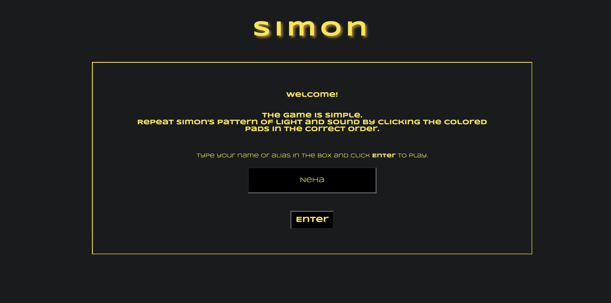
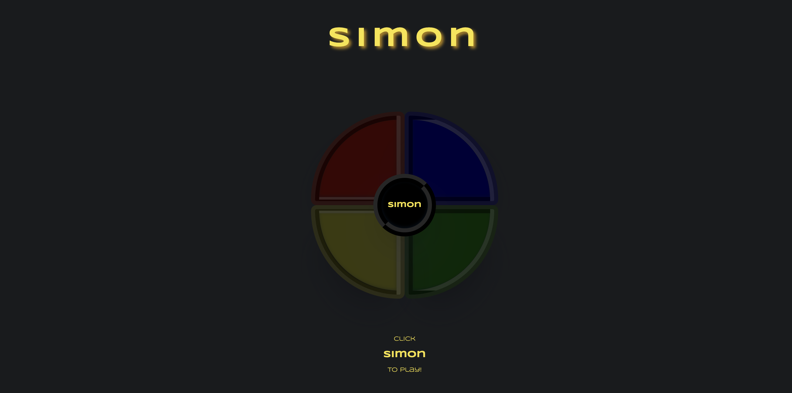
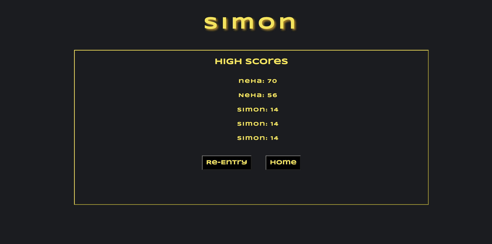
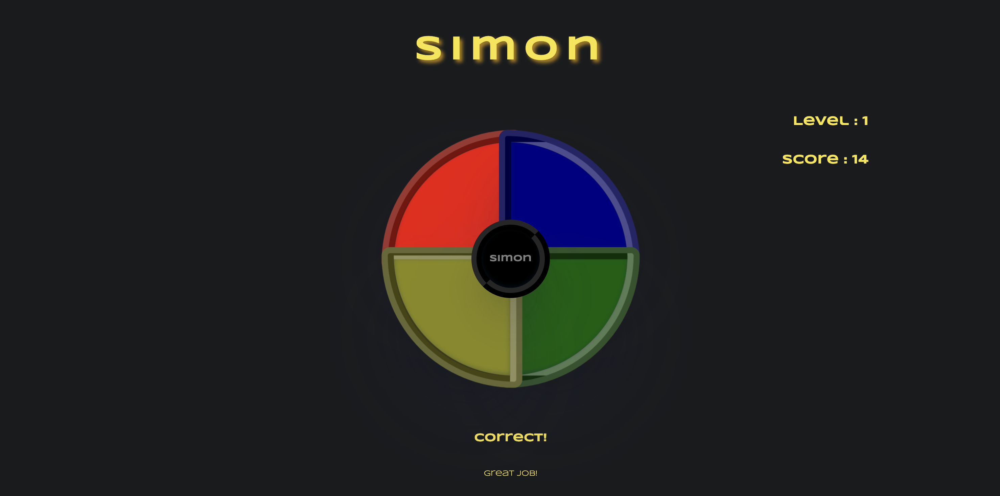
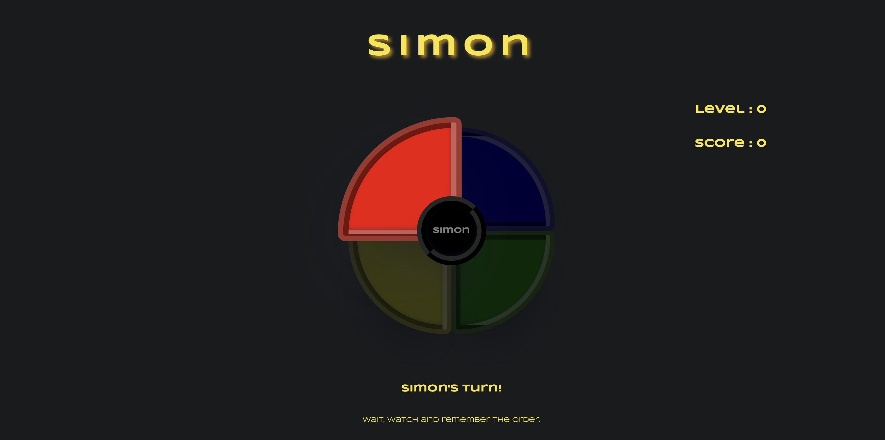

# Simon

Introducing a fun and engaging web browser game that puts your short-term memory to the test! With each level, the sequence of light and sounds becomes longer, challenging players to remember and repeat the pattern. Developed using HTML, CSS, and JavaScript, this game is sure to provide hours of entertainment while also sharpening your memory skills. Give it a try and see how far you can go!

## First Look

### Landing Screen
 

### Game Screen

### High Scores Screen

### Level Up Indicator

### Game Over Indicator 

### Simons Turn

## Technology Used
- HTML
- CSS 
- JavaScript
- Deployed on GitHub Pages

## Getting Started

To play, click here: [Simon](https://bholeneha.github.io/simon/)

### How to Play

- Enter your name or alias in the input box and click enter.
- Click the simon button in the center of the color tabs to start. 
- Wait, watch and remember Simon's order of color and sounds. 
- When its your turn, click the color tabs in the same order as Simon. 
- Remember, you get 5 seconds to respond once its your turn!
- If your order matches Simon's, its level up. 
- If you make a mistake or dont wait for Simon to finish his turn, game over. 

## Next Steps 
- Add buttons on/off, speed selector 
- Add sounds for game over and level up
- Add buttons to turn simon on and off, choose speed, and number of colors and tones
- Make it responsive 