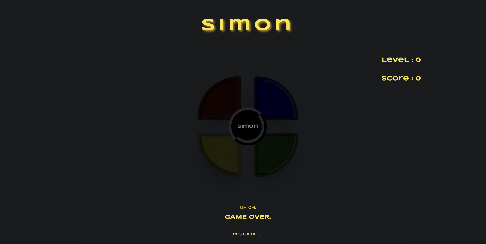

# Simon

by [<b>Neha Bhole</b>](https://www.linkedin.com/in/nehabhole/)

Timeline: 6 days

🕹️ [<b>Try Simon</b>](https://bholeneha.github.io/simon/) 

 

* * *

### Table of Contents
- [Simon](#simon)
    - [Table of Contents](#table-of-contents)
  - [Overview](#overview)
    - [First Look](#first-look)
  - [Getting Started](#getting-started)
    - [Requirements](#requirements)
    - [How to Play](#how-to-play)
  - [Development Process](#development-process)
    - [Timeframe \& Working Team](#timeframe--working-team)
    - [Technologies Used](#technologies-used)
    - [Planning Process](#planning-process)
      - [Brief](#brief)
      - [Sketches](#sketches)
      - [Project Management](#project-management)
    - [Build/Code Process](#buildcode-process)
    - [Challenges](#challenges)
    - [Wins](#wins)
    - [Key Learning](#key-learning)
    - [Future Features](#future-features)
  - [Contributors](#contributors)
  - [Author Information](#author-information)

 

* * *

## Overview 

 

<b>Simon</b> is a classic, fun and engaging web browser game that puts your short-term memory to the test! With each level, the sequence of light and sounds becomes longer, challenging players to remember and repeat the pattern. Developed using HTML, CSS, and JavaScript, this game is sure to provide hours of entertainment while also sharpening your memory skills. Give it a try and see how far you can go!

Built in 7 days, I chose to build this game to get a better a understanding of asynchronous functions. 

 

### <b>First Look</b>

Landing Screen
 

Game Screen

High Scores Screen

Level Up Indicator

Game Over Indicator 

Simons Turn

 

[Back To The Top](#Simon)

 

* * *

## Getting Started

 

To play, click here: [Simon](https://bholeneha.github.io/simon/)

 

### Requirements

Simon is a desktop only game and can only be played on a web browser using the mouse. No installations required. 

 

### How to Play

- Type your name or alias in the input box and click enter.
- Click the simon button in the center of the color tabs to start. 
- Wait, watch and remember Simon's order of color and sounds. 
- When its your turn, click the color tabs in the same order as Simon. 
- Remember, you get 5 seconds to respond once its your turn!
- If your order matches Simon's, you level up. 
- If you make a mistake or dont wait for Simon to finish his turn, game over. 
  
 

[Back To The Top](#Simon)

 

* * *

## Development Process

 

### Timeframe & Working Team
<u>Timeframe:</u>

This project was built in 6 days. 

<u>Team:</u>

This is a solo project built by: 
  <b>Neha Bhole</b> [📨](mailto:nehasbhole@gmail.com)

 

### Technologies Used
Technologies used for this project are: 
- HTML5
- CSS 
- JavaScript
- Deployed on GitHub Pages 

 

### Planning Process
#### Brief 
#### Sketches   
#### Project Management 

 

### Build/Code Process
 

### Challenges

 

### Wins

 

### Key Learning

 

### Future Features 
- Add buttons on/off, speed selector 
- Add sounds for game over and level up
- Add buttons to turn simon on and off, choose speed, and number of colors and tones
- Make it responsive 
  
[Back To The Top](#Simon)

* * *

## Contributors
This is a solo project built by: 
  <b>Neha Bhole</b> [📨](mailto:nehasbhole@gmail.com)
  
* * *

<!-- ## License & Copyright -->

<!-- * * * -->

## Author Information

- [LinkedIn ](https://www.linkedin.com/in/nehabhole/)
- [Portfolio Website](https://nehabhole.com/)
  
[Back To The Top](#Simon)